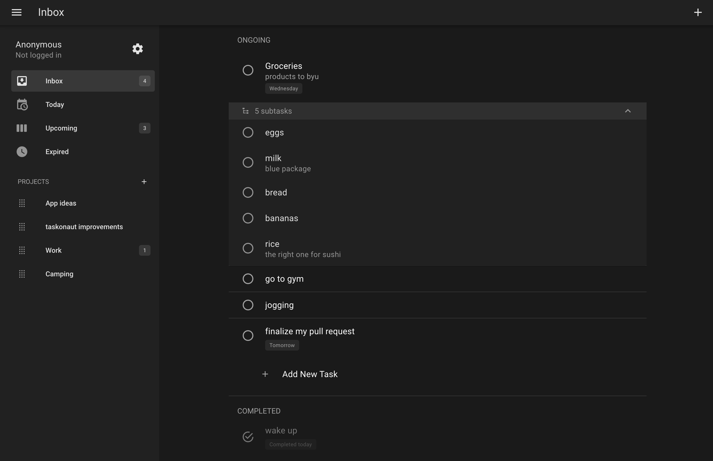

# taskonaut

<p align="center">
  
</p>


An application that will help you organize your daily life and arrange all the tasks in the shelves.



# Features

- Adding tasks and subtasks 🎉
- Task organization by groups
- Intelligent distribution of tasks by folder depending on the specified deadline
- Change the order of tasks using Drag&Drop
- Authorization with Google OAuth
- Synchronization of tasks between devices
- Installable PWA app for desktop and mobile devices


## Project Setup

```sh
npm install
```

### Compile and Hot-Reload for Development

```sh
npm run dev
```
